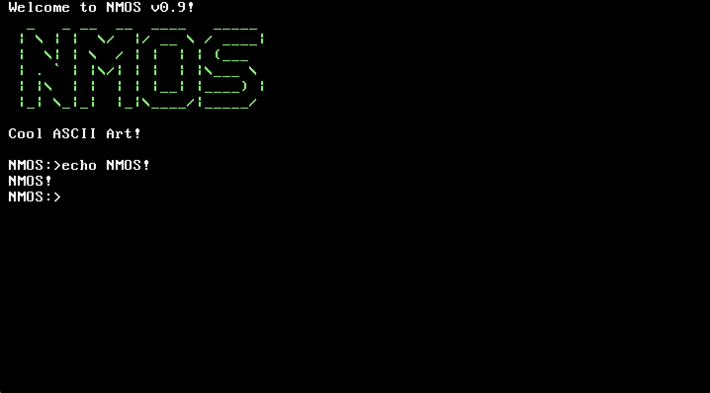

# NMOS
An OS I'm working on.

### NOTE: development has been halted, please use <a href="https://github.com/nm111/AlphaOS">AlphaOS!</a> ###

## Compiling ##

To compile you will need a <a href="http://wiki.osdev.org/GCC_Cross-Compiler">i686 cross-compiler</a>.

### All files: ###

	make

or

	make all

### Specific file: ###

	make foo.c

Replace foo.c with the name of the file.

### Make and run: ###

	make run

## ISO building tools: ##

~~ISOs are currently NOT SUPPORTED and attempting to run an ISO will result in the OS hanging.~~
ISOs sort of work now. But they still could be glitchy so you shouldn't rely on them.

### Build ISO: ###

	make iso

### Build ISO and run: ###

	make run-iso
